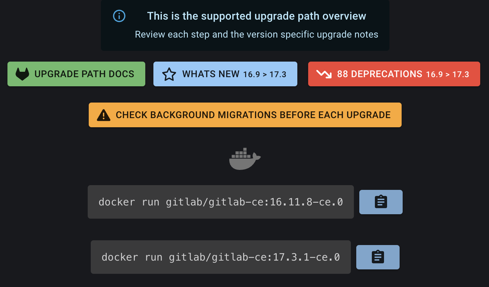

# Self-Hosted GitLab CE ARM Docker Image Builder

<div align="center">

[](https://gitlab.com/a_anand_91119/gitlab-arm/-/releases)   

---
 


<div>


This repository facilitates the building of Docker images for GitLab Community Edition (CE), tailored for ARM-based devices, including systems utilizing Ampere processors.

## Usage Instructions
These images can be utilized directly via `Docker` or through `docker-compose`. Below is an example `docker-compose.yml` file to assist in setting up a GitLab CE instance on ARM devices.

```yml
version: '3.6'
services:
  gitlab:
    image: 'aanand91119/gitlab-arm:$GITLAB_IMAGE_TAG'
    restart: always
    container_name: gitlab
    hostname: 'gitlab.yourdomain.com'
    ports:
      - '80:80'
      - '443:443'
      - '8443:22'
    volumes:
      - '$GITLAB_HOME/config:/etc/gitlab'
      - '$GITLAB_HOME/logs:/var/log/gitlab'
      - '$GITLAB_HOME/data:/var/opt/gitlab'
    shm_size: '256m'
```

> Ensure you create a `.env` file alongside your `docker-compose.yml` and define the values for `GITLAB_HOME` and `GITLAB_IMAGE_TAG`.

```env
GITLAB_HOME=/home/ubuntu/gitlab
GITLAB_IMAGE_TAG=Any_Tag_Available_In_This_Repository
```

## Requesting Specific GitLab Versions
If a desired GitLab version is not available, please raise an issue specifying the exact version required, and I will accommodate the request.

## Upgrading Self-Hosted GitLab Instances
To upgrade your self-hosted instance
1. Visit the [Gitlab Upgrade Path](https://gitlab-com.gitlab.io/support/toolbox/upgrade-path/?distro=docker&edition=ce) tool.
2. Provide the following details:
    - **Current version** of your GitLab instance.
    - **Target version** for the upgrade.
    - Select **Community Edition** as the edition.
    - Choose **Docker** as the distribution.
3. The tool will display the upgrade path for your desired version, as shown below.

  
For example, upgrading from version `16.8.1` to `17.3.1` would involve the following steps:
  - First, upgrade from `16.8.1` to `16.11.8`, complete the migrations.
  - Then, proceed with the upgrade from `16.11.8` to `17.3.1`.
